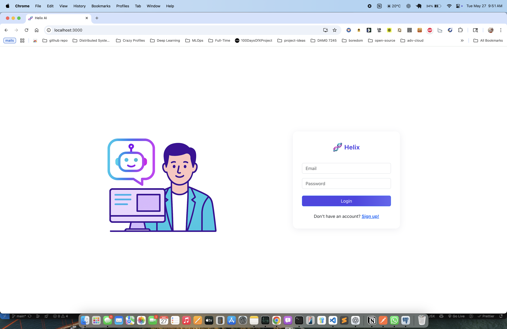
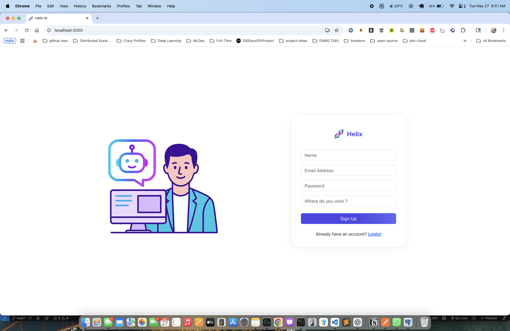
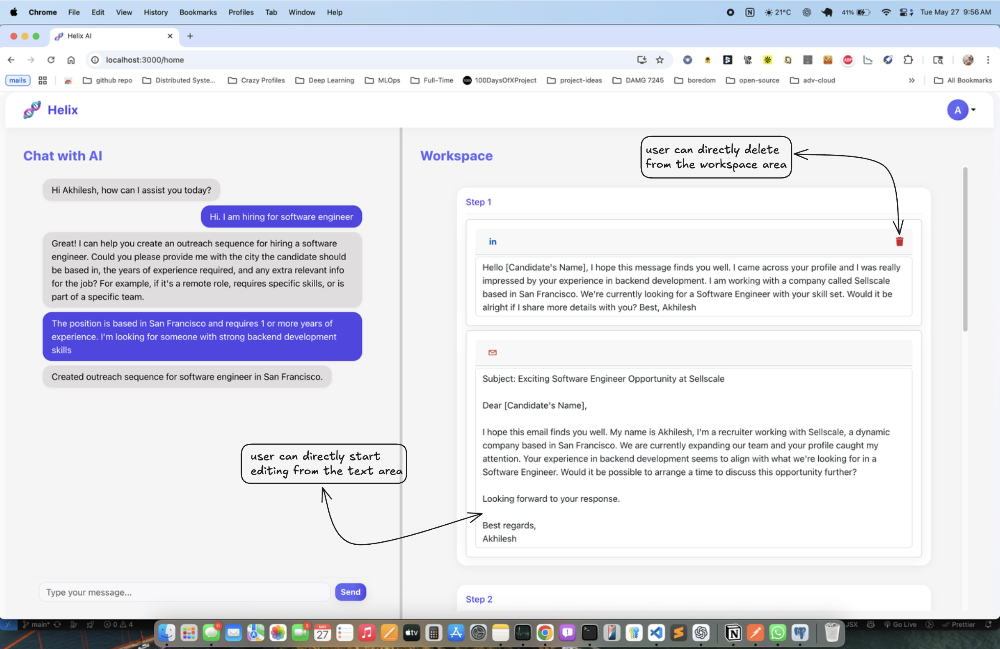
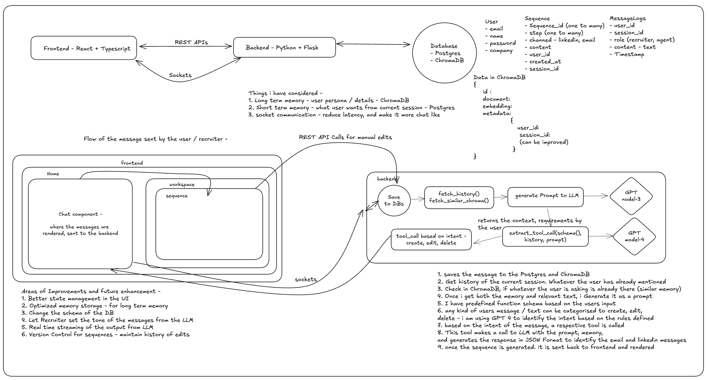

# Helix - The Agentic Recruiter

Helix is a real-time AI-powered recruiter assistant designed to streamline the outreach process for recruiters. With Helix, recruiters can chat naturally, generate and edit personalized multi-step outreach sequences, and manage sequences manually through a workspace UI. 

This tool is built with a combination of **React**, **Flask**, **PostgreSQL**, **Socket.IO**, **OpenAI GPT-4**, and **ChromaDB** to provide real-time interaction, memory recall, and intelligent sequence creation.


---

## Features

- **Conversational AI** – Recruiters can talk to Helix naturally to create or modify outreach messages.
- **Sequence Editor** – AI-generated recruiting sequences are editable directly in the UI with autosave support.
- **Tool Call Detection** – Detects recruiter intent and dynamically calls backend tools (`create_sequence`, `edit_sequence`, `delete_step`).
- **Workspace View** – Visually structured sequence steps for LinkedIn and Email messaging.
- **Memory Integration** – Uses ChromaDB to remember recruiter-specific messages and context for future use.
- **Real-time Updates** – Powered by Socket.IO for low-latency interactions.

---

## Tech Stack

| Layer         | Technology                      |
|--------------|----------------------------------|
| Frontend     | React, TypeScript, Bootstrap     |
| Backend      | Python, Flask, Flask-SocketIO    |
| Database     | PostgreSQL (relational DB)       |
| Vector Store | ChromaDB                         |
| Embeddings   | OpenAI Embedding API             |
| LLM          | OpenAI GPT-4                     |
| Messaging    | Socket.IO (real-time messaging)  |

---


## Setting up locally

### 1. Unzip the project
```bash
cd helix
```

### 2. Backend Setup - Flask
- Prerequisites 
  - Python 3.0 +
  - PostgreSQL
  - OpenAI API Key
  - ChromaDB
  
- create and setup environment variables in ```.env``` file
  - ### Example .env file 
  
  ```bash
  DATABASE_URL=
  CHROMA_DB_PORT=
  OPENAI_API_KEY=
  CHROMA_DB_URL=
  ```


  ```bash
  cd backend
  python3 -n venv .env
  source venv/bin/activate
  ```

  - Install dependencies
    ```bash
    pip install -r requirements.txt
    ```
  - Start ChromaDB (as HTTP Server)
    ```bash
    chroma run --host localhost --port 8000
    ```
  - Run the backend server
    ```bash
    flask run
    ```

### 3. Frontend Setup - React
-   Prerequisites
    -   node 18+
    -   npm
- Create and Setup ```.env``` file
  
  - Example ```.env``` file
  
    ```
    REACT_APP_API_URL=
    REACT_APP_PORT=
    ```
- Start the frontend 
  
    ```bash
    npm start
    ```

    **Usually starts React at https://localhost:3000, unless a specific port is specified.**

## Example workflow 

1.	Log in with your name and company (mocked for now).
2.	Chat with Helix: “Create a sequence for a Backend Engineer in New York with 5 years experience.”
3.	Watch Helix respond with a recruiting sequence.
4.	Click into the workspace panel and:
    - Manually edit steps with autosave.
    - Delete any step using the 🗑 icon.
    - Ask Helix to edit or append new steps via chat.


## How the UI looks 

### Login and Signup page




### Home page (after login)



### Architecture of the MVP 



